<div align="center">


# FoodSave

### Plateforme Anti-Gaspillage Alimentaire

*Connectez commerçants et associations pour sauver les invendus alimentaires*

[](https://github.com/NASRHOUDA/foodsave-app)
[](LICENSE)
[](https://hub.docker.com/u/houdanasr)
[](kubernetes/)
[](Jenkinsfile)
[](https://argoproj.github.io/)

<br/>

[Fonctionnalités](#-fonctionnalités) · [Architecture](#-architecture) · [Stack](#-stack-technique) · [Démarrage](#-démarrage-rapide) · [CI/CD](#-cicd--gitops) · [Monitoring](#-monitoring)

</div>

---

## 📋 Description

**FoodSave** est une plateforme qui connecte les **commerçants** ayant des invendus alimentaires avec des **associations** locales pour lutter contre le gaspillage. Un algorithme de matching intelligent calcule automatiquement les meilleures correspondances, et un système de notifications WebSocket synchronise les acteurs en temps réel.

> 🍽️ 10 millions de repas jetés chaque jour en France · 🤝 3 500 associations manquent de ressources · 👥 8 millions de personnes ont besoin d'aide alimentaire

---

## 🚀 Fonctionnalités

<table>
<tr>
<td width="50%" valign="top">

**👨‍🍳 Côté Commerçant**
- Inscription / Connexion sécurisée (JWT)
- Publication de dons (type, quantité, adresse, dates)
- Consultation et filtrage de ses dons
- Réception & gestion des demandes d'associations
- Suggestions de matching automatiques
- Notifications en temps réel (WebSocket)

</td>
<td width="50%" valign="top">

**🤝 Côté Association**
- Inscription avec capacité et préférences alimentaires
- Visualisation des dons disponibles (géolocalisation)
- Envoi de demandes avec message personnalisé
- Suivi des demandes (en attente / acceptée / refusée)
- Notifications en temps réel (WebSocket)

</td>
</tr>
</table>

**🎯 Fonctionnalités transverses**

- Algorithme de matching scoré (distance · capacité · type d'aliment · historique)
- Tableau de bord avec statistiques globales
- Interface moderne, responsive, composants React réutilisables
- Monitoring complet via Prometheus + Grafana

---

## 🏗️ Architecture

### Microservices

| Service | Techno | Port | Rôle |
|---|---|---|---|
| `user-service` | Node.js / Express | 3001 | Authentification JWT, gestion des utilisateurs |
| `donation-service` | Python / FastAPI | 3002 | CRUD des dons, gestion des demandes |
| `frontend` | React / Vite | 3003 | Interface utilisateur |
| `notification-service` | Node.js / WebSocket | 3004 | Notifications temps réel |
| `matching-service` | Python / FastAPI | 3005 | Algorithme de scoring et suggestions |

### Algorithme de Matching

Le score de compatibilité est calculé selon quatre critères :

| Critère | Poids | Détail |
|---|---|---|
| 📍 Distance | 40 % | < 5 km → 40 pts · 5–10 km → 30 pts · 10–20 km → 15 pts |
| 📦 Capacité | 30 % | Capacité ≥ quantité → 30 pts · Partielle → 20 pts |
| 🥘 Type d'aliment | 20 % | Correspond aux préférences → 20 pts |
| 📊 Historique | 10 % | Collaborations passées → 0–10 pts |

### Pipeline CI/CD

```
GitHub Push → Jenkins Build → Docker Hub → GitOps Repo → ArgoCD Sync → Kubernetes
```

---

## 🛠️ Stack Technique

| Catégorie | Technologies |
|---|---|
| **Frontend** | React.js, Vite, Bootstrap, Axios, Socket.io-client |
| **Backend** | Node.js (Express), Python (FastAPI) |
| **Bases de données** | PostgreSQL (utilisateurs), MongoDB (dons) |
| **Containerisation** | Docker, Docker Compose |
| **Orchestration** | Kubernetes (Minikube) |
| **GitOps** | ArgoCD |
| **CI/CD** | Jenkins, Docker Hub |
| **Monitoring** | Prometheus, Grafana |

---

## 📁 Structure du Projet

```
foodsave-app/
├── docker-compose.yml           # Orchestration locale
├── Jenkinsfile                  # Pipeline CI/CD
│
├── user-service/                # Auth & utilisateurs (Node.js)
│   ├── Dockerfile
│   ├── package.json
│   └── server.js
│
├── donation-service/            # Dons & demandes (FastAPI)
│   ├── Dockerfile
│   ├── main.py
│   └── requirements.txt
│
├── notification-service/        # WebSocket temps réel (Node.js)
│   ├── Dockerfile
│   ├── package.json
│   └── server.js
│
├── matching-service/            # Algorithme de scoring (FastAPI)
│   ├── Dockerfile
│   ├── main.py
│   └── requirements.txt
│
├── foodsave-frontend/           # Interface React / Vite
│   ├── src/
│   │   ├── components/          # Navbar, NotificationBell, MatchingSuggestions…
│   │   ├── pages/               # Login, Dashboard, CreateDonation, Stats…
│   │   └── services/            # donationService, matchingService…
│   └── Dockerfile
│
├── kubernetes/                  # Manifests Kubernetes
│   ├── namespace/
│   ├── user-service/
│   ├── donation-service/
│   ├── notification-service/
│   ├── matching-service/
│   ├── frontend/
│   ├── postgres/
│   └── mongodb/
│
└── docs/screenshots/            # Captures d'écran
```

---

## ⚡ Démarrage Rapide

### Prérequis

- [Docker Desktop](https://www.docker.com/products/docker-desktop/)
- Node.js 18+
- Python 3.11+

### 1 — Cloner le dépôt

```bash
git clone https://github.com/NASRHOUDA/foodsave-app.git
cd foodsave-app
```

### 2 — Démarrer les services backend

```bash
docker-compose up -d
```

### 3 — Démarrer le frontend

```bash
cd foodsave-frontend
npm install
npm run dev -- --port 3003
```

### 4 — Accéder à l'application

| Service | URL |
|---|---|
| Frontend | http://localhost:3003 |
| User Service API | http://localhost:3001 |
| Donation Service API | http://localhost:3002 |
| Notification Service | http://localhost:3004 |
| Matching Service API | http://localhost:3005 |

### Comptes de test

| Rôle | Email | Mot de passe |
|---|---|---|
| 🧑‍🍳 Commerçant | boulangerie.paris@test.com | password123 |
| 🤝 Association | restos.paris@test.com | password123 |

---

## 🔄 CI/CD & GitOps

Le pipeline est entièrement automatisé :

1. **Push GitHub** → déclenche le pipeline Jenkins
2. **Jenkins** → build des 5 images Docker
3. **Docker Hub** → push des images (`houdanasr/foodsave-*`)
4. **GitOps repo** → mise à jour des manifests Kubernetes
5. **ArgoCD** → détecte le changement et synchronise
6. **Kubernetes** → déploiement des nouvelles images

**Haute disponibilité :** 2 réplicas par service · 12 pods en production · redémarrage automatique en cas de panne.

---

## 📊 Monitoring

Métriques collectées par **Prometheus** et visualisées dans **Grafana** :

- CPU & mémoire par pod
- Trafic réseau entrant / sortant
- Taux d'erreurs HTTP
- Uptime des services

### Accéder aux dashboards

```bash
# Grafana
minikube service prometheus-grafana -n monitoring --url
# Login: admin / <voir les secrets Kubernetes>

# Prometheus
kubectl port-forward -n monitoring \
  service/prometheus-kube-prometheus-prometheus 9090:9090
```

---

## 📸 Captures d'écran

| | |
|---|---|
| 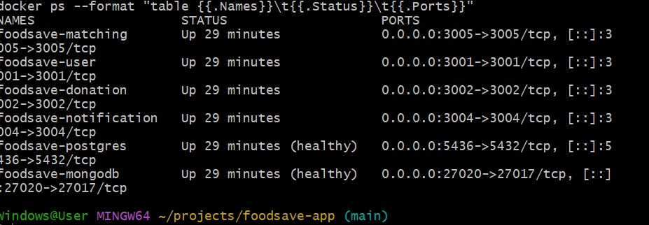 | 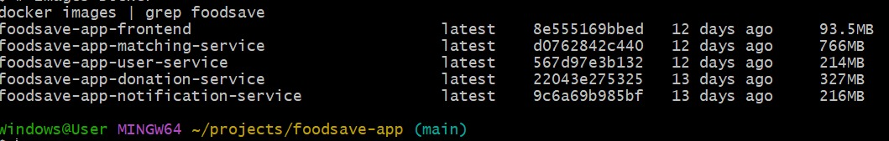 |
| 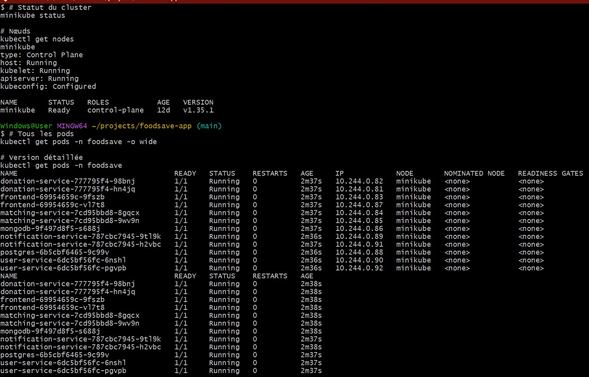 | 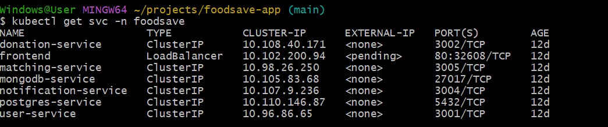 |
| 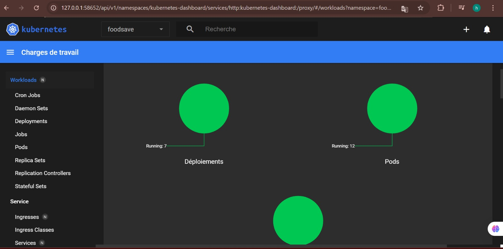 | 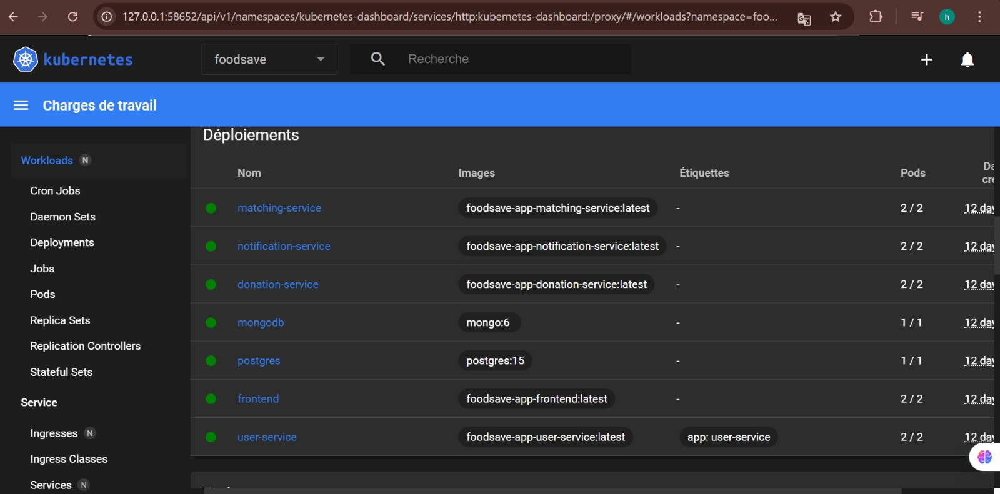 |
| 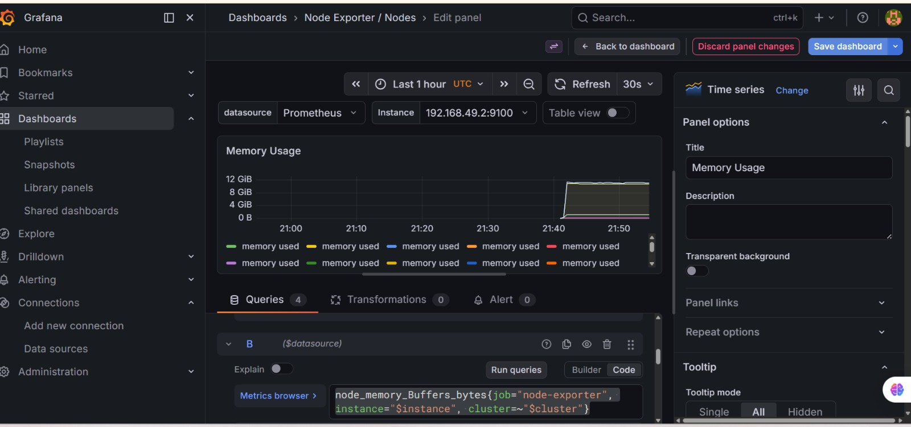 | 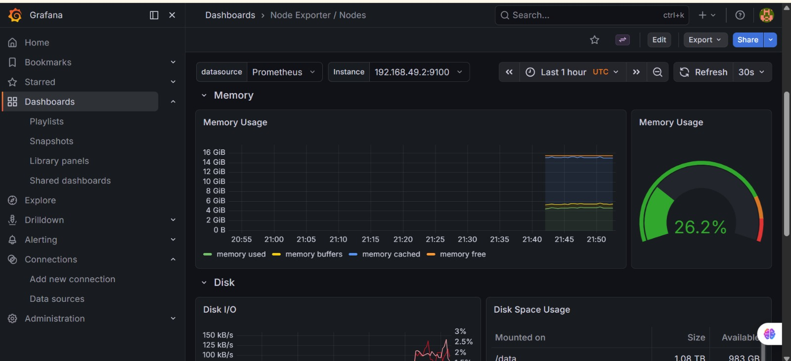 |
| 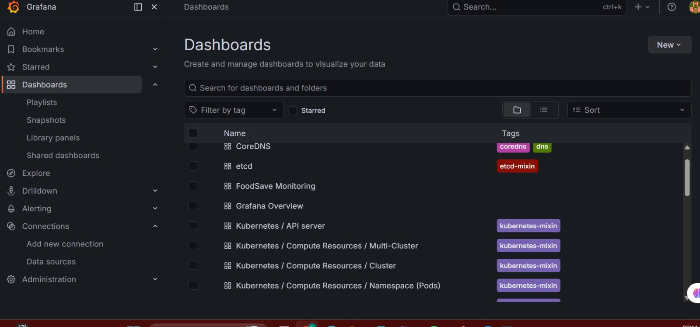 | 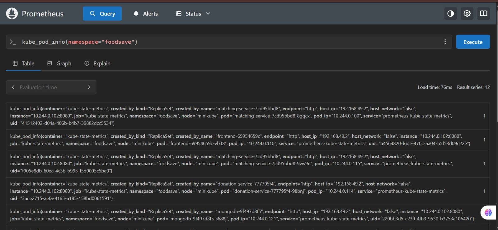 |
| 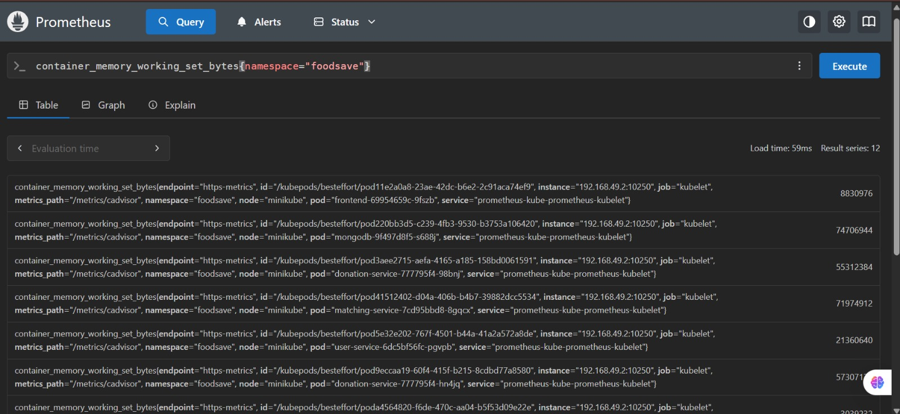 | 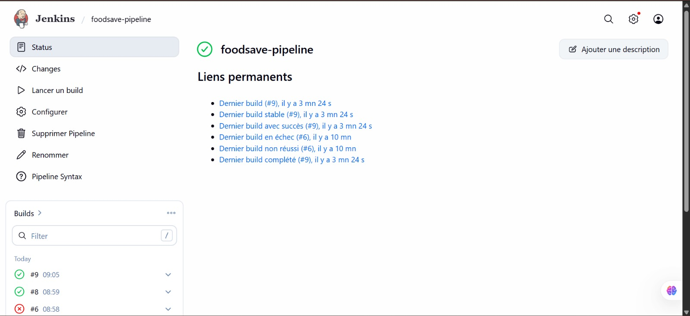 |
|  | 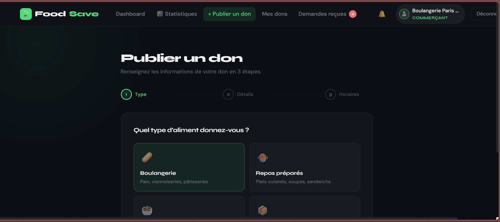 |
| 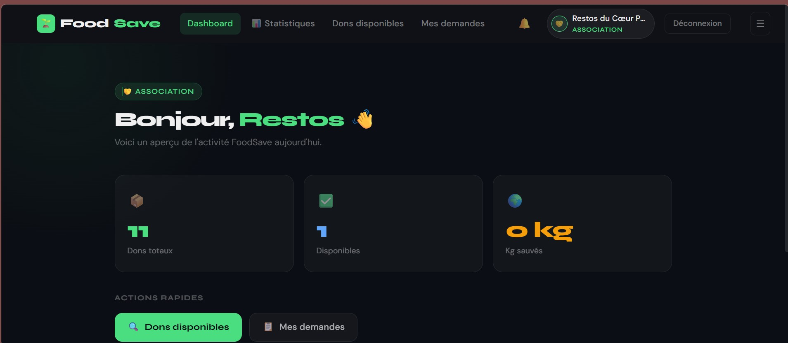 | 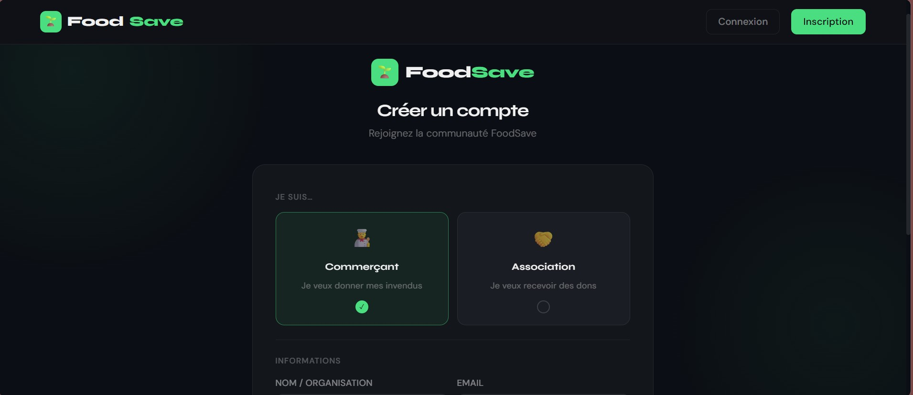 |
| 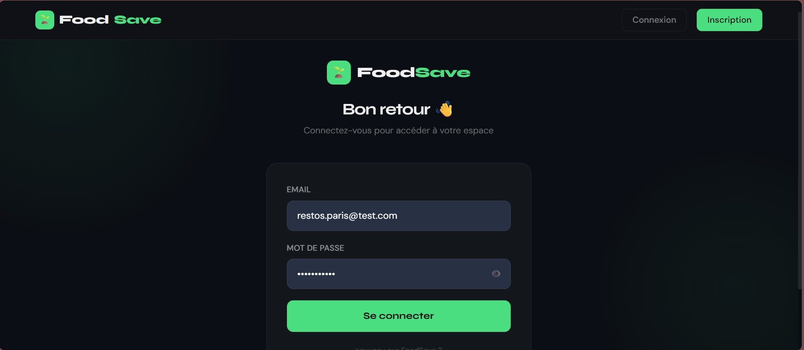 | |

---

## 👩‍💻 Auteure

**Houda Nasr** — DevOps Engineer & Full Stack Developer

[](https://houdanasr.vercel.app)
[](https://www.linkedin.com/in/houda-nasr-16b9a032a/)
[](mailto:houdanasr520@gmail.com)
[](https://github.com/NASRHOUDA)

---

## 📄 Licence

Ce projet est distribué sous licence **MIT**. Voir le fichier [LICENSE](LICENSE) pour plus de détails.

---

<div align="center">


**FoodSave — Donnons une seconde vie aux aliments 🌱**

</div>
